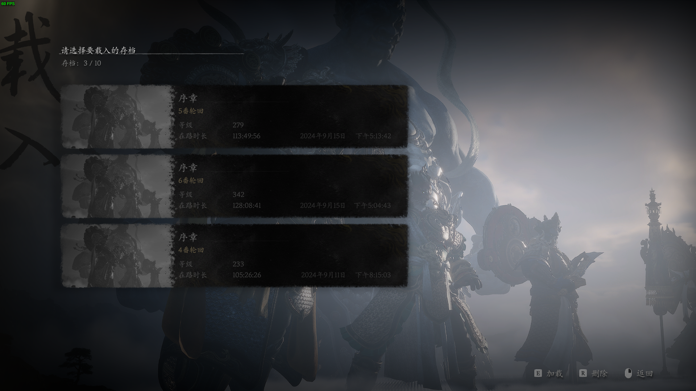

# 黑神话悟空高周目满成就存档分享

## 简介
这是一份纯手打的《黑神话：悟空》四周目全成就存档，旨在分享和备份。后续还将更新分享五、六周目的存档。（已更新五周目2024.9.13，已更新六周目2024.9.15）

## 使用方法
1. 将.sav存档文件重命名，即将数字改为“第二步文件夹”中不重复的数字。
2. 打开游戏本地文件夹BlackMythWukong\b1\Saved\SaveGames\streamId\。
3. 将重命名后的存档文件放置于该目录下。
4. 启动游戏。

## 注意事项
存档是重要且脆弱的物件，请珍惜并及时备份。

# Black Myth: Wukong high-Week Full Achievement Save File

This is a purely hand-crafted save file for Black Myth: Wukong, shared for backup purposes. Subsequent updates will share the save files for the fifth and sixth weeks.（the fifth weeks has updated in 2024.9.13，the sixth weeks has updated in 2024.9.15）

## Usage Method:

1. Rename the `.sav` file, changing the number to a non-repeating number in the "second step folder".
2. Open the game's local file `BlackMythWukong\b1\Saved\SaveGames\streamId\`.
3. Place the renamed file in this directory.
4. Launch the game.

## Note:

Save files are important and fragile items. Please cherish and backup them in time.
